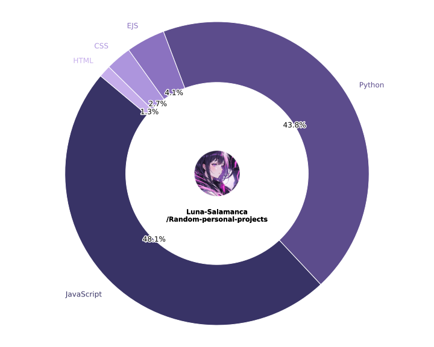

# Language Chart

This script generates a donut chart showing the languages used in the [Random-personal-projects](https://github.com/Luna-Salamanca/Random-personal-projects) repo.

It fetches language stats from GitHub and adds my avatar in the center, along with the repo name. The chart is saved in both SVG and PNG formats.

The output lives in the `charts/` folder and updates automatically whenever I push to the repo.

---

### Files

- `generate_chart.py` – script that makes the chart
- `charts/languages.svg` – main chart (vector)
- `charts/languages.png` – fallback image

---

That's it. Just something simple I wanted to make.
