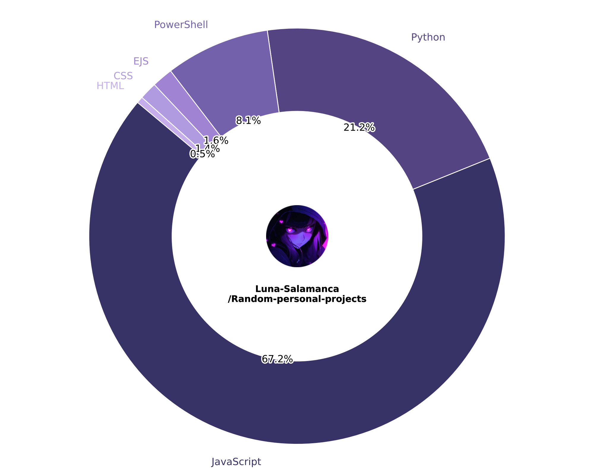

# Luna's Verified Useless Projects

Welcome to my chaotic little corner of the internet   
This monorepo is a collection of small, strange, and occasionally brilliant projects that mostly exist because... why not?

Every file here is either:
- A complete distraction
- A questionable form of therapy
- Something genius
- Or a terrible idea executed flawlessly

---

## Projects
 
| Project | Description |
|--------|-------------|
| [placeholder 1](./placeholder1/) | placeholder1. |
| [placeholder 2](./placeholder2/) | placeholder2. |
| [placeholder 3](./placeholder3/) | placeholder3. |
| [placeholder 4](./placeholder4/) | placeholder4. |
| [placeholder 5](./placeholder5/) | placeholder5. |

---

## How to Run Stuff

Each project has its own folder with instructions. If it doesn't, skill issue.

---

## ⚠️ Disclaimer of Functionality

Some of these projects might be:

- Broken (technically speaking)
- Untested (emotionally)
- Or held together by sheer force of will

Use at your own risk. Or don't. I'm not your boss.

---

<table>
  <tr>
    <td style="width: 50%;">
      
    </td>
    <td style="vertical-align: top; padding-left: 20px;">
      <h3 style="margin-top: 0;"> Language Breakdown</h3>
      
This chart shows the languages used across my questionable creations.

      
It's updated automatically with every push using a GitHub Action I set up — mostly as an excuse to learn how workflows actually work.

      
Also yes, my avatar is in the middle. You're welcome.

    </td>
  </tr>
</table>

